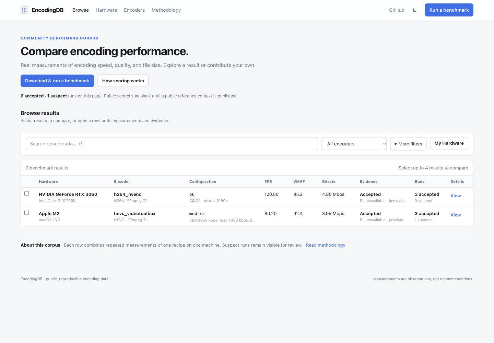
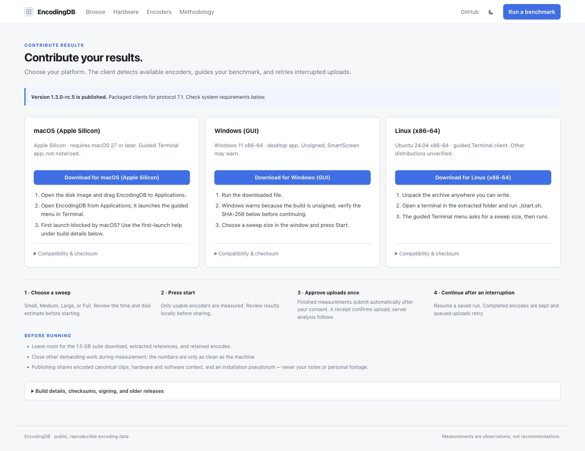
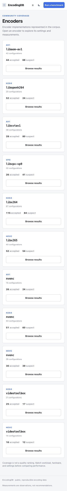

# Overnight client and frontend evidence · October 4–5, 2026

**Upload conservation passed for all 1,042 valid measured attempts on the tested native packages.** Frontend polish passed 93 tests and desktop/mobile interaction checks. This packet does **not** approve a release or merge, promise universal reliability, or make PL recommendation-ready.

## What passed

| Native role | Total attempts | Warmups | Measured uploads confirmed | Unresolved |
|---|---:|---:|---:|---:|
| Linux | 396 | 112 | 284 | 0 |
| macOS | 310 | 98 | 212 | 0 |
| Windows console | 390 | 126 | 264 | 0 |
| Windows GUI campaign | 408 | 126 | 282 | 0 |
| **Total** | **1,504** | **462** | **1,042** | **0** |

[Client acceptance summary](client-acceptance-summary.json) records exact receipt → run → artifact/payload binding and confirmed retention, with 1,042 distinct server run IDs. Recovery completed 136 previously pending uploads through ordinary backoff/quota behavior, without new encodes or changes to original measurement evidence. GUI campaign recovery used the pinned console package against its existing queue; actual GUI Retry/Stop behavior was tested separately below.

**Upload success is separate from scientific acceptance.** During the recorded observation window, October 5 06:11:40–06:41:16 UTC, server runs were 414 accepted, 432 suspect and 196 pending. These are historical observations. The [final terminal analysis snapshot](final-analysis-summary.json), captured October 5 at 11:11:52 UTC, records **512 COMPLETE/ACCEPTED and 530 SUSPECT**, zero pending analyses/leases/recomputations, and no identity or retention failures across all 1,042 runs. Suspect results are not accepted results. All 1,042 had bound analysis rows. The [isolated analysis window was closed](analysis-window-closure.json), with application concurrency restored to 0 and image, storage, TLS, scientific settings and all 18 public-table row counts preserved. Later analysis and PL disposition remain separate; see the [PL objective preparation and remaining gates](../pl-20261004/README.md).

## Fault and restart coverage

[Native fixture summary](native-fixture-summary.json) contains 15 passing cases using real pinned executables and copied authentic envelopes/media against an **explicit loopback fixture backend**:

- macOS and Linux: interruption at create, authorization, PUT and response-read, plus commit/drop-response/replay — five cases each.
- Windows console: commit/drop-response/replay — one case.
- Windows GUI: ordinary manual Retry, Stop at each of the four network barriers, clean Close, restart and Retry — four cases.

Each passing case retained unacknowledged bytes, recovered the original identity, recorded one PUT and created zero new attempt records. Original fixture inputs remained unchanged. Prior exact-package evidence also covers Windows preparation Stop, 180-second quiescence and subsequent Close. Normal GUI metadata IPC is evidenced through successful mandatory online preflight (a source-grounded inference). Direct Close during active preparation and a dedicated native metadata-child cancellation trace remain unexecuted. Earlier failed harness runs remain preserved; the fixture was corrected to model server deduplication after commit. **Real-backend post-commit lost-response injection was not executed.** These fixture cases supplement, rather than replace, the 1,042 actual isolated-backend upload bindings.

Package manifests record build revision `3e798c70be64bf87bc821cb629aebbc68cdc3819`. The reviewed client/packaging trees at `44b9e1501bc1bbdc2133317bd83ce5d847ad4103` are equivalent; that reviewed revision must not be described as an embedded executable revision. Provenance is established by [release manifests and executable digests](package-provenance.json). The client Git tree is `fb49268dab61478beff268d9c73eeac4aefadb8e`. Executable SHA-256 values appear per case. No whole-server-tree equivalence is claimed.

## Source and UI verification

[Verification summary](verification-summary.json):

| Check | Result |
|---|---|
| Client suite | 748 passed |
| Frontend suite | 93 passed across 18 files |
| Frontend lint, TypeScript and production build | Passed |
| Server suite with eight real PostgreSQL bindings, explicit four-way concurrency | 285 passed, 0 failed, 0 skipped |
| UI | Desktop 1440 × 1000, mobile 390 × 844, dark theme and keyboard checks |

UI checks covered filter navigation, contained wide tables, comparison focus trapping and Escape/restore, result-details focus restoration, mobile navigation, methodology interaction and directory links. Real read-only API/UI checks showed six hardware groups and eleven encoder groups. Those directories show observed coverage and accepted/suspect counts, without cross-workload averages or implied recommendations.

All **13 CI checks passed at source revision `a5b38ab`**, including strict preflight, stack-smoke, independent audits and all three native build jobs. [Exact CI receipt](ci-source-verification.json). The runner uses the same explicit reporter locally and in CI; deliberate diagnostics are asserted, while unexpected errors remain visible.

### Selected screenshots

These are unchanged captures from local production-build previews. See [screenshot metadata](screenshots.json). Fixture screenshots are visual/interaction evidence only. Counts in real-data screenshots reflect capture time.

**Browse, desktop — development fixtures:**

**Download page — existing public rc.5 configuration, not a new release:**

**Encoder directory, mobile — real isolated backend observations:**

## Evidence handling and remaining boundaries

[Private evidence checksums](private-evidence-checksums.json) bind selected original conservation reports, bound-server observations, native fault results, package manifests, test logs and screenshots. Logical evidence IDs replace private paths. Raw run/installation identifiers, session details, host paths and credentials are not copied into this packet; originals remain intact with the task owner. Hashes establish correspondence with those retained snapshots, not independent certification.

This packet records the tested source/package scope. It does not claim untested hardware/OS combinations, production deployment, release publication or scientific recommendation eligibility. PL remains **not recommendation-ready** until its independent evidence requirements pass.

The temporary frontend previews and read-only API preview were [stopped after verification](preview-cleanup.json); screenshots and source evidence remain preserved.
